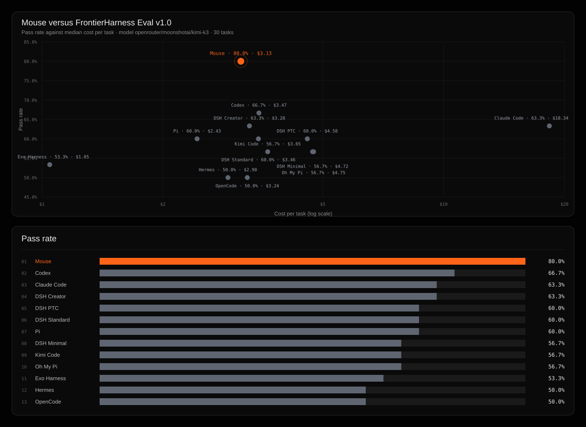

# Mouse on FrontierHarness Eval

> **Read this first.** This is run 1 of 1 (n=1). It was executed on a GCE VM through Harbor for both task suites, not on FrontierHarness's Runta golden checkpoints, and the DeepSWE tasks went through Harbor rather than Pier. The model was Kimi K3 via OpenRouter pinned to Fireworks, so pass rate is comparable and cost includes OpenRouter's fee. The comparison rows are fetched from the eval repo at commit `8f11b130` at report-build time. Mouse makes no comparative claim from this run until three full runs at pinned versions are published with mean and range; see `provenance.json` and `docs/evals.md`.

**80.0% pass rate** (24/30 tasks) at **$3.13 per task**, ranking **1 of 13** on pass rate against the published FrontierHarness v1.0 configurations.

## Result

| Metric | Value |
| --- | --- |
| Pass rate | 80.0% |
| Tasks passed | 24 / 30 |
| Cost per task | $3.13 |
| Median cost per successful task | $0.31 |
| Median time per successful task | 4m 11s |
| Median cache hit rate | 83.8% |
| Mean turns | 51.0 |

## Comparison

| # | Harness | Pass rate | Cost per task | Cache, median | Median time |
| --- | --- | --- | --- | --- | --- |
| 01 | **Mouse** | 80.0% | $3.13 | 83.8% | 4m 11s |
| 02 | Codex | 66.7% | $3.47 | 88.0% | 6m 43s |
| 03 | Claude Code | 63.3% | $18.34 | 67.8% | 9m 38s |
| 04 | DSH Creator | 63.3% | $3.28 | 84.3% | 6m 44s |
| 05 | DSH PTC | 60.0% | $4.58 | 87.2% | 7m 44s |
| 06 | DSH Standard | 60.0% | $3.46 | 86.5% | 6m 17s |
| 07 | Pi | 60.0% | $2.43 | 79.4% | 7m 33s |
| 08 | DSH Minimal | 56.7% | $4.72 | 84.6% | 5m 41s |
| 09 | Kimi Code | 56.7% | $3.65 | 88.0% | 7m 56s |
| 10 | Oh My Pi | 56.7% | $4.75 | 82.2% | 6m 46s |
| 11 | Exo Harness | 53.3% | $1.05 | 70.3% | 6m 17s |
| 12 | Hermes | 50.0% | $2.90 | 85.9% | 6m 58s |
| 13 | OpenCode | 50.0% | $3.24 | 78.4% | 6m 27s |

## Reproducibility

| Field | Value |
| --- | --- |
| Run id | `2026-09-03-k3-openrouter` |
| Golden checkpoint | `null` |
| Model | `openrouter/moonshotai/kimi-k3` |
| Provider | `openrouter` |
| Harness repo | `https://github.com/mousedev/mouse-harness` |
| Harness commit | `pre-extraction (private monorepo getchannel/mouse, harness closure as of 2026-09-03; byte-identical prompts and config are asserted by packages/opencode/test/golden.test.ts)` |
| Runtime | 8 vCPU, 32768 MiB |
| Harbor | `harbor 0.22.0` |
| Pier | `not used` |
| DeepSWE corpus | `unknown` |
| Started | 2026-09-03T00:00:00Z |

Every trial is a fresh restore of the same golden checkpoint, so all runs share an identical cold start with the same vCPU, memory, disk contents, and memory state. No formal task was executed before the checkpoint was frozen.

## Task results

| Task | Result | Cost | Time | Turns | Evidence |
| --- | --- | --- | --- | --- | --- |
| `datacurve/anko-typed-variable-bindings` | failure | $2.64 | 21m 2s | 52 | [evidence](../trials/datacurve-anko-typed-variable-bindings) |
| `datacurve/arktype-json-schema-refs-dependencies` | pass | $10.32 | 89m 36s | 190 | [evidence](../trials/datacurve-arktype-json-schema-refs-dependencies) |
| `datacurve/expr-try-catch-errors` | pass | $8.59 | 44m 44s | 134 | [evidence](../trials/datacurve-expr-try-catch-errors) |
| `datacurve/fastapi-deprecation-response-headers` | pass | $7.08 | 85m 33s | 150 | [evidence](../trials/datacurve-fastapi-deprecation-response-headers) |
| `datacurve/httpx-multipart-response-parsing` | pass | $6.06 | 70m 48s | 141 | [evidence](../trials/datacurve-httpx-multipart-response-parsing) |
| `datacurve/katex-multicolumn-array-spans` | failure | $5.65 | 44m 53s | 117 | [evidence](../trials/datacurve-katex-multicolumn-array-spans) |
| `datacurve/meriyah-explicit-resource-declarations` | failure | $8.47 | 65m 49s | 139 | [evidence](../trials/datacurve-meriyah-explicit-resource-declarations) |
| `datacurve/python-statemachine-state-data-scoping` | pass | $13.49 | 73m 22s | 201 | [evidence](../trials/datacurve-python-statemachine-state-data-scoping) |
| `datacurve/scc-bounded-memory-spilling` | pass | $4.65 | 52m 44s | 84 | [evidence](../trials/datacurve-scc-bounded-memory-spilling) |
| `terminal-bench/build-cython-ext` | pass | $0.93 | 13m 9s | 47 | [evidence](../trials/terminal-bench-build-cython-ext) |
| `terminal-bench/chess-best-move` | pass | $0.59 | 6m 13s | 18 | [evidence](../trials/terminal-bench-chess-best-move) |
| `terminal-bench/code-from-image` | pass | $0.09 | 1m 10s | 8 | [evidence](../trials/terminal-bench-code-from-image) |
| `terminal-bench/constraints-scheduling` | pass | $0.31 | 4m 50s | 15 | [evidence](../trials/terminal-bench-constraints-scheduling) |
| `terminal-bench/db-wal-recovery` | pass | $0.15 | 2m 23s | 13 | [evidence](../trials/terminal-bench-db-wal-recovery) |
| `terminal-bench/dna-insert` | pass | $0.71 | 11m 5s | 18 | [evidence](../trials/terminal-bench-dna-insert) |
| `terminal-bench/extract-elf` | failure | $0.49 | 7m 49s | 13 | [evidence](../trials/terminal-bench-extract-elf) |
| `terminal-bench/gcode-to-text` | failure | $0.71 | 9m 54s | 27 | [evidence](../trials/terminal-bench-gcode-to-text) |
| `terminal-bench/git-leak-recovery` | pass | $0.14 | 2m 6s | 15 | [evidence](../trials/terminal-bench-git-leak-recovery) |
| `terminal-bench/kv-store-grpc` | pass | $0.15 | 2m 32s | 17 | [evidence](../trials/terminal-bench-kv-store-grpc) |
| `terminal-bench/largest-eigenval` | failure | $1.03 | n/a | 20 | [evidence](../trials/terminal-bench-largest-eigenval) |
| `terminal-bench/log-summary-date-ranges` | pass | $0.25 | 3m 33s | 21 | [evidence](../trials/terminal-bench-log-summary-date-ranges) |
| `terminal-bench/merge-diff-arc-agi-task` | pass | $0.30 | 4m 4s | 19 | [evidence](../trials/terminal-bench-merge-diff-arc-agi-task) |
| `terminal-bench/modernize-scientific-stack` | pass | $0.21 | 3m 28s | 10 | [evidence](../trials/terminal-bench-modernize-scientific-stack) |
| `terminal-bench/multi-source-data-merger` | pass | $0.19 | 3m 8s | 10 | [evidence](../trials/terminal-bench-multi-source-data-merger) |
| `terminal-bench/openssl-selfsigned-cert` | pass | $0.20 | 2m 45s | 13 | [evidence](../trials/terminal-bench-openssl-selfsigned-cert) |
| `terminal-bench/polyglot-c-py` | pass | $0.15 | 2m 35s | 14 | [evidence](../trials/terminal-bench-polyglot-c-py) |
| `terminal-bench/regex-log` | pass | $0.51 | 7m 50s | 21 | [evidence](../trials/terminal-bench-regex-log) |
| `terminal-bench/sanitize-git-repo` | pass | $0.47 | 3m 58s | 26 | [evidence](../trials/terminal-bench-sanitize-git-repo) |
| `terminal-bench/sqlite-db-truncate` | pass | $0.32 | 4m 17s | 21 | [evidence](../trials/terminal-bench-sqlite-db-truncate) |
| `terminal-bench/vulnerable-secret` | pass | $0.18 | 2m 16s | 17 | [evidence](../trials/terminal-bench-vulnerable-secret) |

Each evidence directory holds the agent trajectory, verifier logs, the collected `model.patch`, and raw runner output for that trial.

## Caveats

- Kimi K3 was served by openrouter rather than Fireworks, which the baselines used. Pass rate stays comparable because the model is the same; confirm the provider's input, cached-input, and output token prices match before comparing cost.
- Baseline costs reprice first-turn cache reads consistently across harnesses. The comparison uses `effective_cost_per_pass` (total cost over all tasks divided by passes), which is reproducible from raw per-task cost.

---

Baseline data and methodology: [FrontierHarness Eval](https://frontierharness.org/)
