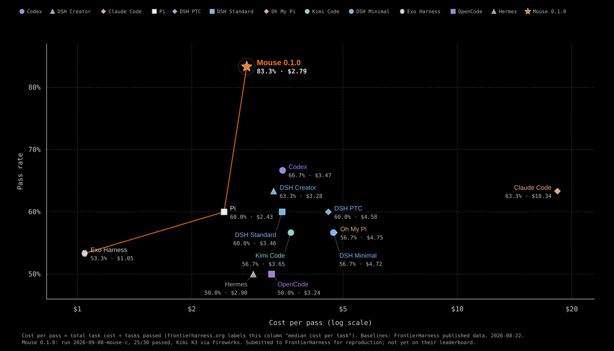

# Mouse 0.1.0 on FrontierHarness Eval

## Result

| Metric | Value |
| --- | --- |
| Pass rate | 83.3% |
| Tasks passed | 25 / 30 |
| Cost per pass | $2.79 |
| Complete cost coverage | 30/30 tasks |
| Median cost per successful task | $0.18 (25/25 successes measured) |
| Median time per successful task | 6m 24s |
| Median cache hit rate | 90.6% |
| Cache measurement coverage | 25/25 successful tasks with measured cache rates |
| Mean turns | 57.5 |

## Comparison

| # | Harness | Pass rate | Median cost per task | Cache, median | Median time |
| --- | --- | --- | --- | --- | --- |
| 01 | Codex | 66.7% | $3.47 | 88.0% | 6m 43s |
| 02 | Claude Code | 63.3% | $18.34 | 67.8% | 9m 38s |
| 03 | DSH Creator | 63.3% | $3.28 | 84.3% | 6m 44s |
| 04 | DSH PTC | 60.0% | $4.58 | 87.2% | 7m 44s |
| 05 | DSH Standard | 60.0% | $3.46 | 86.5% | 6m 17s |
| 06 | Pi | 60.0% | $2.43 | 79.4% | 7m 33s |
| 07 | DSH Minimal | 56.7% | $4.72 | 84.6% | 5m 41s |
| 08 | Kimi Code | 56.7% | $3.65 | 88.0% | 7m 56s |
| 09 | Oh My Pi | 56.7% | $4.75 | 82.2% | 6m 46s |
| 10 | Exo Harness | 53.3% | $1.05 | 70.3% | 6m 17s |
| 11 | Hermes | 50.0% | $2.90 | 85.9% | 6m 58s |
| 12 | OpenCode | 50.0% | $3.24 | 78.4% | 6m 27s |
| — | **Mouse 0.1.0** | 83.3% | $2.79 | 90.6% | 6m 24s |

## Reproducibility

| Field | Value |
| --- | --- |
| Run id | `2026-09-08-mouse-c` |
| Golden checkpoint | `fh-golden-mouse-v3` |
| Model | `fireworks_ai/accounts/fireworks/models/kimi-k3` |
| Provider | `fireworks` |
| Harness repo | `https://github.com/mousedev/mouse-harness` |
| Harness commit | `315e2b8f9cfc389b86a99c5fb0b3725ed647684a` |
| Runtime | 4 vCPU, 8192 MiB |
| Harbor | `0.22.0` |
| Pier | `0.3.1` |
| DeepSWE corpus | `435ee89ec2f2e2289f33b0da4f992f0b7b7266b9` |
| Started | 2026-09-08T20:04:55Z |

## Task results

| Task | Result | Cost | Time | Turns | Cache hit rate | Evidence |
| --- | --- | --- | --- | --- | --- | --- |
| `datacurve/anko-typed-variable-bindings` | pass | $2.62 | 26m 23s | 70 | 96.3% | [evidence](../trials/datacurve-anko-typed-variable-bindings) |
| `datacurve/arktype-json-schema-refs-dependencies` | pass | $10.91 | 81m 26s | 249 | 98.7% | [evidence](../trials/datacurve-arktype-json-schema-refs-dependencies) |
| `datacurve/expr-try-catch-errors` | pass | $5.68 | 41m 20s | 133 | 98.8% | [evidence](../trials/datacurve-expr-try-catch-errors) |
| `datacurve/fastapi-deprecation-response-headers` | pass | $5.60 | 60m 13s | 126 | 98.6% | [evidence](../trials/datacurve-fastapi-deprecation-response-headers) |
| `datacurve/httpx-multipart-response-parsing` | pass | $4.49 | 47m 54s | 124 | 98.7% | [evidence](../trials/datacurve-httpx-multipart-response-parsing) |
| `datacurve/katex-multicolumn-array-spans` | pass | $3.75 | 42m 50s | 108 | 98.5% | [evidence](../trials/datacurve-katex-multicolumn-array-spans) |
| `datacurve/meriyah-explicit-resource-declarations` | failure | $13.67 | 90m 0s | 236 | 98.7% | [evidence](../trials/datacurve-meriyah-explicit-resource-declarations) |
| `datacurve/python-statemachine-state-data-scoping` | pass | $12.94 | 88m 56s | 216 | 98.7% | [evidence](../trials/datacurve-python-statemachine-state-data-scoping) |
| `datacurve/scc-bounded-memory-spilling` | ★ Solved · 0/12 baselines passed | $4.88 | **41m 6s** | 119 | 98.8% | [evidence](../trials/datacurve-scc-bounded-memory-spilling) |
| `terminal-bench/build-cython-ext` | pass | $0.75 | 11m 44s | 52 | 96.8% | [evidence](../trials/terminal-bench-build-cython-ext) |
| `terminal-bench/chess-best-move` | pass | $0.28 | 8m 12s | 32 | 93.9% | [evidence](../trials/terminal-bench-chess-best-move) |
| `terminal-bench/code-from-image` | pass | $0.05 | 2m 40s | 6 | 68.3% | [evidence](../trials/terminal-bench-code-from-image) |
| `terminal-bench/constraints-scheduling` | pass | $0.12 | 5m 28s | 8 | 82.3% | [evidence](../trials/terminal-bench-constraints-scheduling) |
| `terminal-bench/db-wal-recovery` | pass | $0.11 | 5m 46s | 11 | 86.8% | [evidence](../trials/terminal-bench-db-wal-recovery) |
| `terminal-bench/dna-insert` | failure | $0.40 | 15m 57s | 23 | 90.1% | [evidence](../trials/terminal-bench-dna-insert) |
| `terminal-bench/extract-elf` | failure | $0.55 | 13m 6s | 25 | 93.5% | [evidence](../trials/terminal-bench-extract-elf) |
| `terminal-bench/gcode-to-text` | failure | $0.69 | 13m 44s | 21 | 88.9% | [evidence](../trials/terminal-bench-gcode-to-text) |
| `terminal-bench/git-leak-recovery` | pass | $0.10 | 5m 5s | 13 | 88.6% | [evidence](../trials/terminal-bench-git-leak-recovery) |
| `terminal-bench/kv-store-grpc` | ★ Solved · 0/12 baselines passed | $0.13 | **4m 38s** | 16 | 89.6% | [evidence](../trials/terminal-bench-kv-store-grpc) |
| `terminal-bench/largest-eigenval` | ★ Solved · 0/12 baselines passed | $0.27 | **16m 45s** | 16 | 89.3% | [evidence](../trials/terminal-bench-largest-eigenval) |
| `terminal-bench/log-summary-date-ranges` | pass | $0.14 | 4m 6s | 14 | 90.0% | [evidence](../trials/terminal-bench-log-summary-date-ranges) |
| `terminal-bench/merge-diff-arc-agi-task` | pass | $0.18 | 5m 58s | 18 | 90.8% | [evidence](../trials/terminal-bench-merge-diff-arc-agi-task) |
| `terminal-bench/modernize-scientific-stack` | pass | $0.14 | 4m 9s | 14 | 89.8% | [evidence](../trials/terminal-bench-modernize-scientific-stack) |
| `terminal-bench/multi-source-data-merger` | pass | $0.12 | 4m 9s | 8 | 80.1% | [evidence](../trials/terminal-bench-multi-source-data-merger) |
| `terminal-bench/openssl-selfsigned-cert` | pass | $0.12 | 4m 12s | 16 | 90.3% | [evidence](../trials/terminal-bench-openssl-selfsigned-cert) |
| `terminal-bench/polyglot-c-py` | failure | $0.21 | 8m 17s | 17 | 92.8% | [evidence](../trials/terminal-bench-polyglot-c-py) |
| `terminal-bench/regex-log` | pass | $0.16 | 7m 42s | 10 | 85.8% | [evidence](../trials/terminal-bench-regex-log) |
| `terminal-bench/sanitize-git-repo` | pass | $0.42 | 6m 24s | 29 | 94.7% | [evidence](../trials/terminal-bench-sanitize-git-repo) |
| `terminal-bench/sqlite-db-truncate` | pass | $0.18 | 6m 21s | 14 | 90.0% | [evidence](../trials/terminal-bench-sqlite-db-truncate) |
| `terminal-bench/vulnerable-secret` | pass | $0.13 | 3m 56s | 16 | 90.6% | [evidence](../trials/terminal-bench-vulnerable-secret) |

---

Baseline data and methodology: [FrontierHarness Eval](https://frontierharness.org/)
